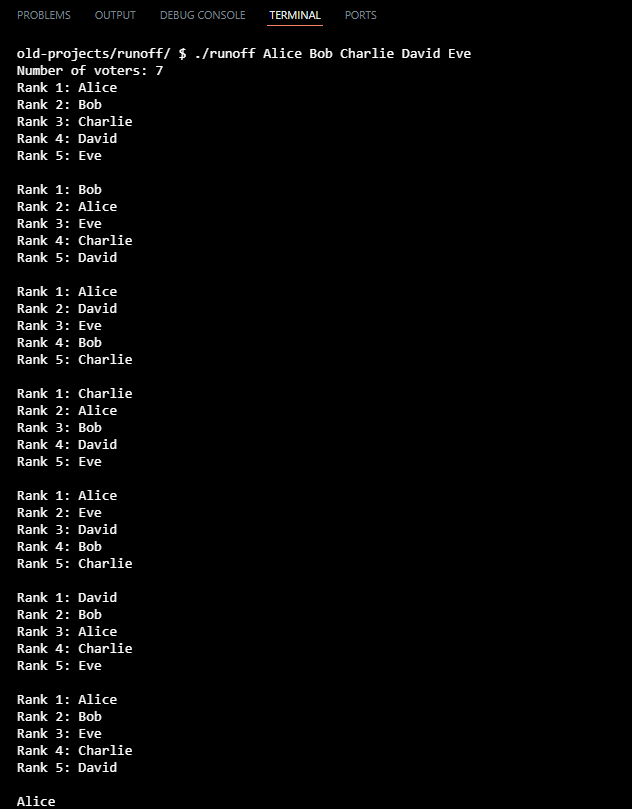

# Runoff Voting System

## Overview
The **Runoff Voting System** simulates a ranked-choice election (instant runoff).  
Voters rank candidates in order of preference. The program eliminates the lowest-ranked candidates iteratively until a winner emerges with majority support.  

This project demonstrates:  
- C programming skills (arrays, structs, functions)  
- Handling user input and command-line arguments  
- Implementing algorithms for real-world problems  
- Debugging and testing multi-step logic  

---

## Features
- Supports **up to 9 candidates** and **100 voters**  
- Handles **ties** and outputs all tied candidates if needed  
- Accepts **command-line arguments** for candidate names  
- Displays **winner clearly** after instant-runoff computation  

---

## How to Run

1. **Compile the program** using CS50’s make command:

    ```bash
    make runoff
    ```

2. **Run the program** with candidate names as command-line arguments:

    ```bash
    ./runoff Alice Bob Charlie
    ```

3. **Follow prompts** to enter the number of voters and rank each candidate for each voter.

  
*Terminal demo showing a sample election with multiple candidates and voters.*

---

## Skills Demonstrated
- C programming: arrays, structs, functions  
- Algorithms: instant-runoff ranked-choice system  
- Command-line argument handling  
- Debugging and testing complex logic  
- Clear presentation of results in terminal  

---

## About Me
This project is part of my growing portfolio in computer science.  
I’m a high school senior exploring CS, AI, web development, and cybersecurity.  
Check out my other projects and demos on my GitHub.

---

## Contact
Email: taran.ubbi@gmail.com
